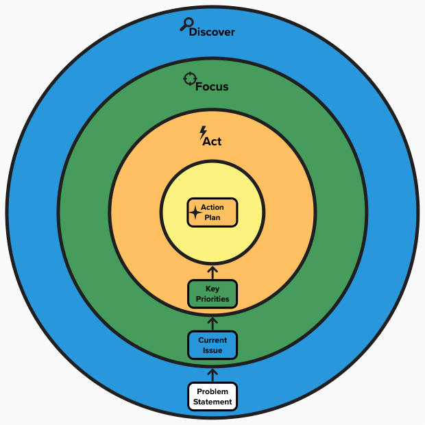
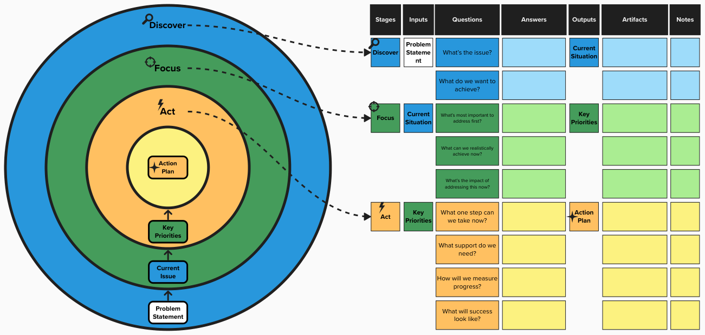

### **Discover-Focus-Act (DFA) Framework**

### **Overview**  
The **Discover-Focus-Act (DFA) Framework** is a simple, effective approach for problem-solving and creating actionable plans. It guides individuals, teams, or workshops through three clear stages: Discover, Focus, and Act, ensuring **clarity**, **focus**, and **measurable results**. Ideal for sessions of 60 minutes or divided into shorter segments, DFA drives progress effectively.

---

### **Why Choose DFA?**  
- No prior expertise required.
- Easy to use, no extensive training required.  
- Structured stages with prompts for actionable inquiry.  
- Bridges the gap between identifying problems and taking concrete action.  
- Encourages clarity, measurable outcomes, and practical results.  
- Promotes collaboration, alignment, and accountability.

---

### **When to Use DFA**  
- Solving complex problems.  
- Aligning teams on priorities.  
- Developing actionable plans for immediate results.  
- Suitable for both personal and professional contexts.

---

### **Icebreaker Activity (5 Minutes - Optional)**  
**Purpose**: Energise participants and provide clarity on the problem.  
**Instructions**:  
- Ask the group: *“If this problem were a headline in tomorrow’s newspaper, what would it say?”*  
- Encourage a mix of responses—funny, serious, or creative.  
- As a group, agree on a headline that best captures the essence of the problem.  

**Note**: This activity is optional. If you're pressed for time or prefer a more focused start, you can skip this.  

**Time-saving Alternative**:  
If time is limited, participants can brainstorm silently and write down a problem statement, which will still help clarify the issue.  

**Output**: Problem Statement  

**Transition**:  
*“Now that we have a shared Problem Statement, let’s dive deeper into understanding it and defining what success looks like.”*

---

### **Stages**

#### **1. Discover (20 Minutes)**  
**Input**: Problem Statement  
**Purpose**: Gain a clear understanding of the problem and desired outcomes.  

**Instructions**:  
- Explore the issue from different perspectives to clarify the situation and desired outcomes. Break the problem into manageable components.  
- Use prompts to guide the discussion and ensure a thorough understanding.  

**Prompts**:  
- *"What’s the issue?"* Describe the current state of the problem.  
- *"What do we want to achieve?"* Define the desired outcome.  

**Resource**: Complete the "Discover" stage in the DFA Template or use alongside the DFA Framework Visual Diagram.  
**Output**: Current Situation  

**Transition**:  
*“With a clearer understanding of the problem, let’s focus on identifying key priorities to address first.”*

---

#### **2. Focus (20 Minutes)**  
**Input**: Current Situation  
**Purpose**: Identify and prioritise the most critical actions.  

**Instructions**:  
- Review the insights from Discover to pinpoint the highest-priority areas for immediate action.  
- Use dot voting or discussion to focus on the most impactful elements.  

**Prompts**:  
- *"What’s most important to address first?"* Prioritise the most critical components.  
- *"What can we realistically achieve now?"* Focus on actions that are feasible in the short term.  
- *"What’s the impact of addressing this now?"* Assess the immediate benefit of tackling this priority.  

**Resource**: Complete the "Focus" stage in the DFA Template or use alongside the DFA Framework Visual Diagram.  
**Output**: Key Priority  

**Transition**:  
*“Now that we’ve identified our top priority, let’s develop a concrete action plan.”*

---

#### **3. Act (20 Minutes)**  
**Input**: Key Priority  
**Purpose**: Create a clear, actionable plan.  

**Instructions**:  
- Convert the identified priority into a concrete action plan. Assign roles, define immediate actions, and ensure steps are achievable.  
- Ensure clear ownership for each task.  

**Prompts**:  
- *"What one step can we take immediately?"* Identify the first step that can be taken without delay.  
- *"What resources or support do we need?"* Define the necessary tools, people, or resources.  
- *"How will we measure progress?"* Establish measurable success criteria with clear metrics.  
- *"What will success look like?"* Define tangible outcomes that signal progress or completion, ensuring alignment with the core objectives.  

**Resource**: Complete the "Act" stage in the DFA Template or use alongside the DFA Framework Visual Diagram.  
**Output**: Action Plan  

**Transition**:  
*“With our action plan in place, it’s time to implement. Afterward, we’ll gather feedback to refine our approach.”*

---

### **Next Steps**  
Once the action plan is in progress, revisit the DFA Framework regularly to refine priorities and make adjustments as needed. This iterative process ensures ongoing improvement.

**Transition to Feedback**:  
*“Once the plan is implemented, we’ll reflect on the results, celebrate successes, and adjust where needed.”*

---

### **Gathering Feedback**  
**Purpose**: Reflect on outcomes and refine the approach.  

**Instructions**:  
- Encourage open feedback to assess what worked, what didn’t, and areas for improvement. Use this input to adjust the plan.  

**Prompts**:  
- *"What worked well?"* Identify successes.  
- *"What didn’t work?"* Assess challenges and areas for improvement.  
- *"What can we do differently next time to improve the process?"* Gather insights on potential improvements for future sessions.  
- *"How can we refine the plan?"* Adjust based on feedback and insights.  

**Closing Reflection**:  
*“Feedback helps us continue improving and ensures we stay on track with our goals.”*

---

### **Features**  
- **Duration**: 60 minutes (20 minutes per stage).  
- **Audience**: Suitable for individuals, teams, or workshops.  
- **Output**: A focused, actionable plan for immediate implementation.  

---

### **DFA Framework Template**
Use this template to guide your session:

| Stages   | Inputs            | Questions                                 | Answers | Outputs           | Artifacts | Notes |
|----------|-------------------|-------------------------------------------|---------|-------------------|-----------|-------|
| Discover | Problem Statement | What’s the issue?                         |         | Current Situation |           |       |
|          |                   | What do we want to achieve?               |         |                   |           |       |
| Focus    | Current Situation | What’s most important to address first?   |         | Key Priorities    |           |       |
|          |                   | What can we realistically achieve now?    |         |                   |           |       |
|          |                   | What’s the impact of addressing this now? |         |                   |           |       |
| Act      | Key Priorities    | What one step can we take now?            |         | Action Plan       |           |       |
|          |                   | What support do we need?                  |         |                   |           |       |
|          |                   | How will we measure progress?             |         |                   |           |       |
|          |                   | What will success look like?              |         |                   |           |       |

---

### **DFA Framework Visual Diagram**  
The DFA Framework is illustrated as a **target diagram** with concentric circles, showing the flow of stages, inputs, and outputs:

- **Outer Circle (Blue):** **Discover** stage (Magnifying Glass Icon).  
  - Input: *Problem Statement* (White) → Output: *Current Situation* (Blue).

- **Middle Circle (Green):** **Focus** stage (Target Icon).  
  - Input: *Current Situation* (Blue) → Output: *Key Priorities* (Green).

- **Inner Circle (Orange):** **Act** stage (Lightning Bolt Icon).  
  - Input: *Key Priorities* (Green) → Output: *Action Plan* (Orange).

- **Centre Circle (Yellow):** Final **Action Plan (Orange)** (4 Point Star Icon).  



The Visual Diagram serves as a quick reference guide and can be used as a facilitation tool during the session to track progress visually.

**Facilitator Tip:**  
Leverage the target diagram as a **visual facilitation tool** alongside or in place of the **DFA Framework Template**. As participants progress through each stage, capture their inputs and outputs directly on the diagram using sticky notes or markers. For virtual sessions, use digital tools like Miro or MURAL to enable real-time collaboration. This method keeps the group engaged, enhances clarity, and creates a visual record of the session's progress.



---

### **Examples**
Add Examples [TODO]

---

### **For Experienced Facilitators: Customising the DFA Framework**

The DFA Framework is designed to be adaptable, allowing experienced facilitators to adjust the process to suit their specific needs. Here are some tips for customising the framework:

#### **Customising Prompts**  
Feel free to replace the suggested questions with prompts that better align with your group’s goals and dynamics. For example, instead of asking *“What do we want to achieve?”*, try asking *“What would you like to have happen?”* or *“What barriers might we need to overcome to achieve this?”*.

#### **Adjusting Time Slots**  
While the DFA Framework is typically designed for a 60-minute session, you can modify the time allocations as needed. For instance:
- **If you have more time**: Consider expanding each stage to allow for deeper discussions or additional activities (e.g., group brainstorming, role-playing, or ideation).
- **If you have less time**: Condense the stages by focusing on the most critical questions and streamlining decision-making.
- **If the problem is complex**: For complex issues, consider dedicating a separate session to each stage on different days to allow for deeper exploration.

#### **Advanced Facilitation Techniques**  
- **Dot Voting & Prioritisation**: For larger groups, use tools like Mentimeter, Miro, or MURAL for voting or prioritisation, ensuring everyone’s input is captured and visible.
- **Breakout Groups**: If you’re working with a larger team, split the group into smaller breakout sessions during the **Discover** or **Focus** stages. This can help generate more diverse insights and provide a more personalised experience.
- **Time Management**: Set stricter time limits for each stage, especially in larger sessions, to keep discussions focused and on track. Use a timer to manage transitions.
- **Incorporate Additional Tools**: Depending on the session's needs, bring in tools like Liberating Structures or ORSC to enhance group alignment and decision-making.

#### **Flexibility in Transitions**  
While transitions between stages are designed to be smooth, feel free to adjust them based on your style and the group’s needs. For example:
- Instead of directly moving to the **Focus** stage, consider conducting a quick recap of the **Discover** stage to ensure alignment and clarity.
- If your group needs more time to reach consensus, extend certain stages and adjust subsequent stages as necessary to maintain flow.

---

### **Getting Started**  
1. Clone this repository:  
   ```bash
   git clone https://github.com/uijaz/DFA-Framework.git
   ```  
2. Explore the provided downloadable PDFs in the `resources` folder. [TODO]  
3. Follow the 3-stage process in a 60-minute session or at your own pace.  

---

### **Repository Structure**
```
DFA-Framework/
├── README.md                # Project overview  
├── LICENSE                  # License information  
├── resources/               # Templates and worksheets [TODO] 
│   ├── DFA-Framework.png  
└── examples/                # Use case examples [TODO] 
```

---

### **License**  
This project is licensed under **Creative Commons Attribution 4.0 (CC BY 4.0)**. See [LICENSE](./LICENSE.md) for details.

---

### **Contributing**  
Contributions are welcome! To contribute:  
1. Fork the repository.  
2. Create a new branch.  
3. Submit a pull request with a description of your changes.  

---

### **Contact**  
For questions or feedback, reach out via GitHub Issues or [LinkedIn](https://www.linkedin.com/in/uijaz/).
